## Pertemuan 2

| Register | Login | Dashboard |
|---------|------|-----------|
| 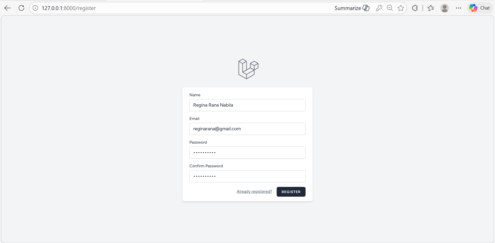 | 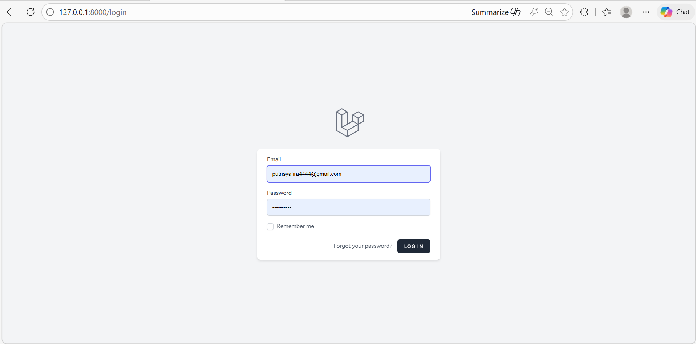 | 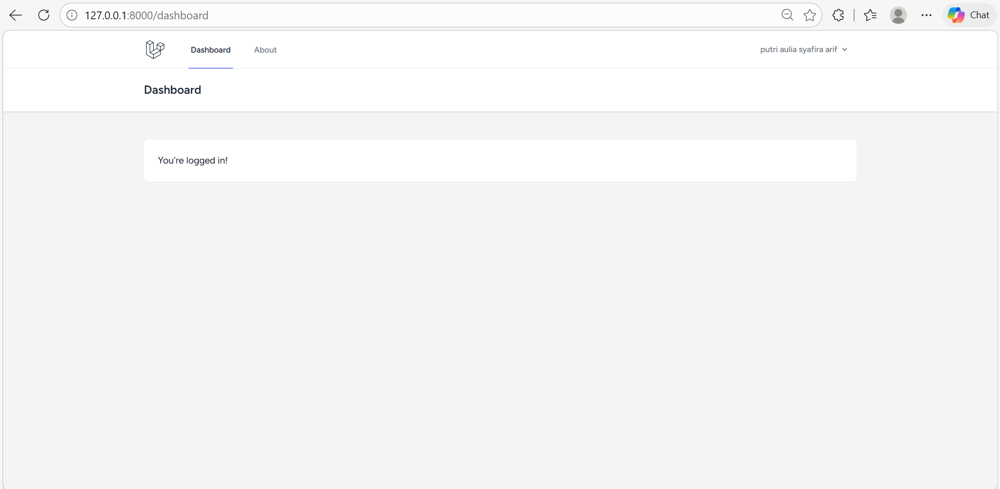 |

---

## Pertemuan 3

|  ERD | Model Users | Model Product | Model Kategori |
|---------|---------|---------|---------|
| 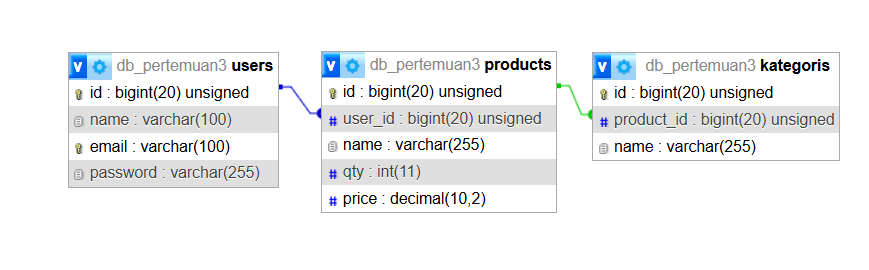 | 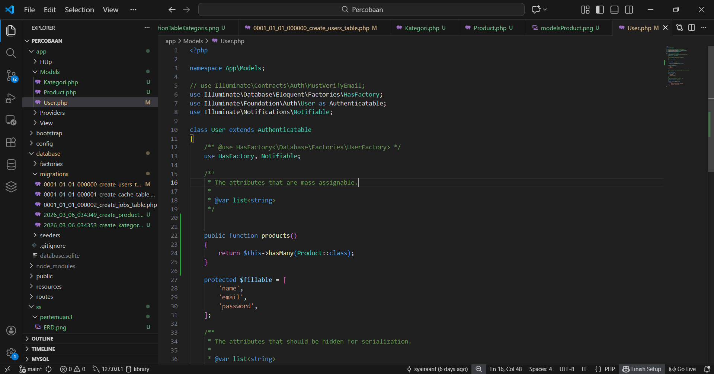 | 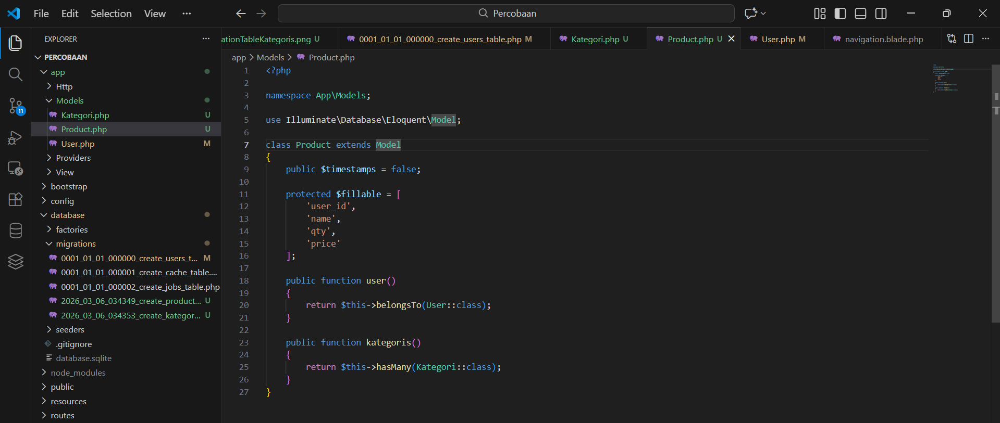 | 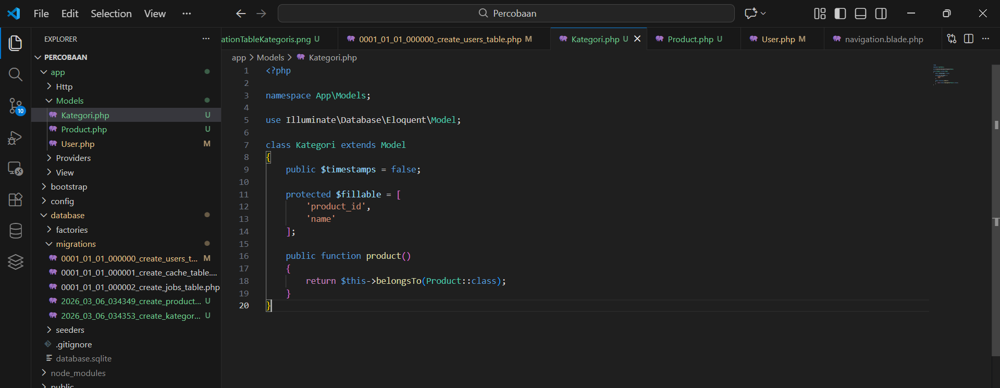 |

| Database | Migration User | Migration Product | Migration Kategori |
|---------|---------|---------|---------|
| 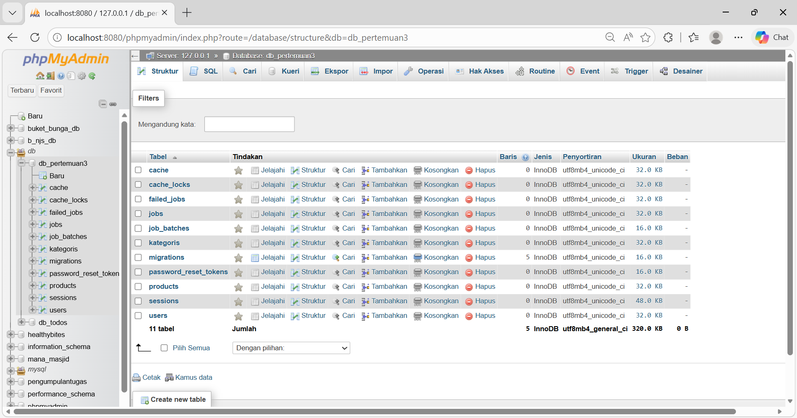 | 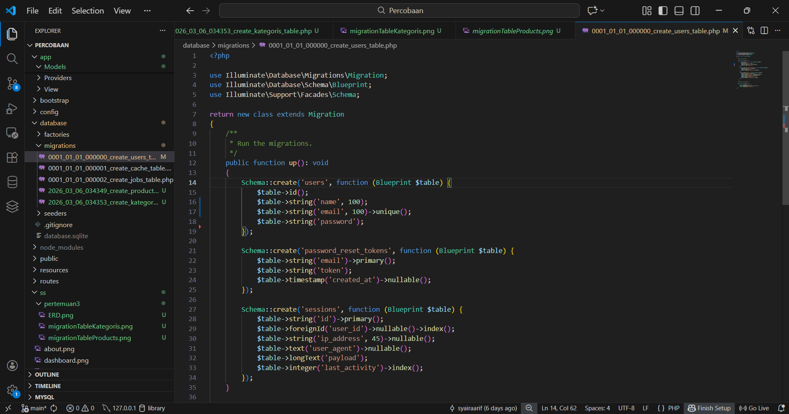 | 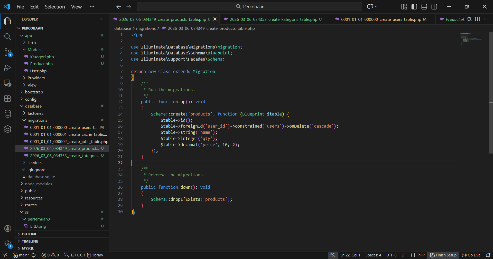 | 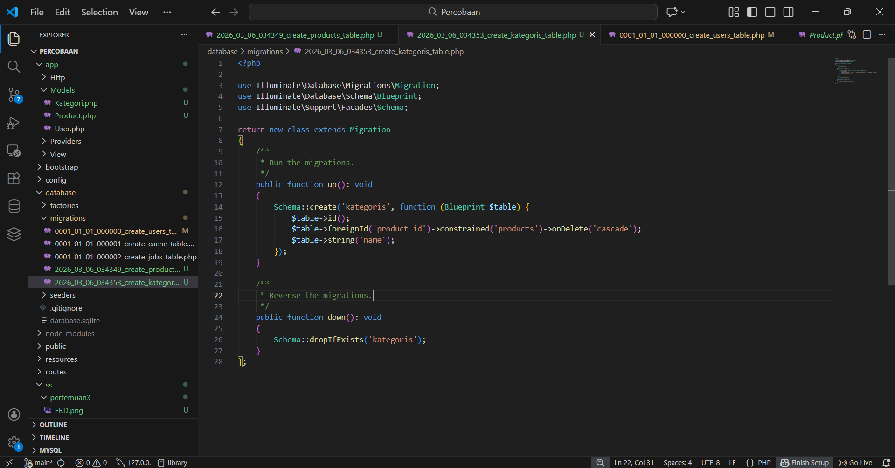 |   

## Pertemuan 4

|  Table Product | Table Product After Data dihapus | Halaman Product | Halaman Product After Tambah Data |
|---------|---------|---------|---------|
| 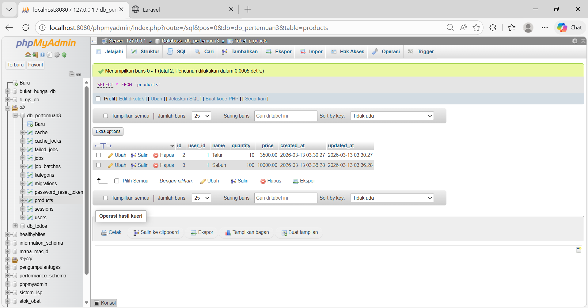 | 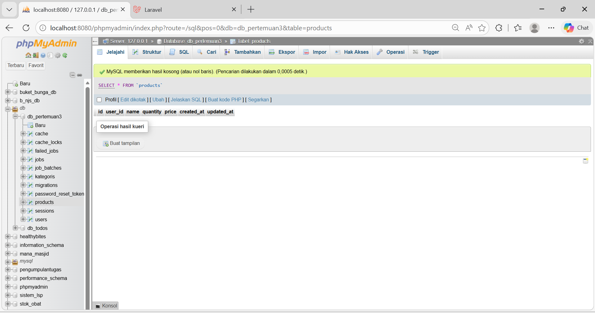 | 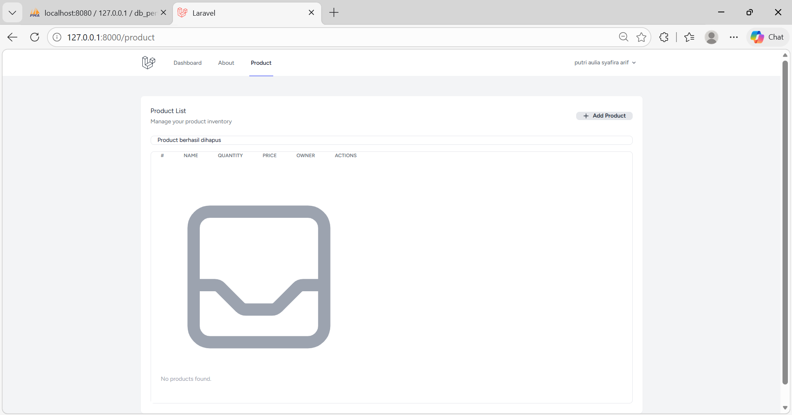 | 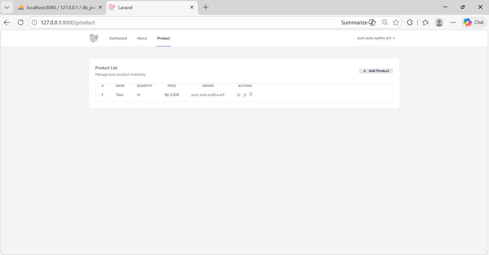 |

| Halaman Product After Tambah Data | Halaman Tambah Product | Halaman Edit Product | Halaman View one Product |
|---------|---------|---------|---------|
| 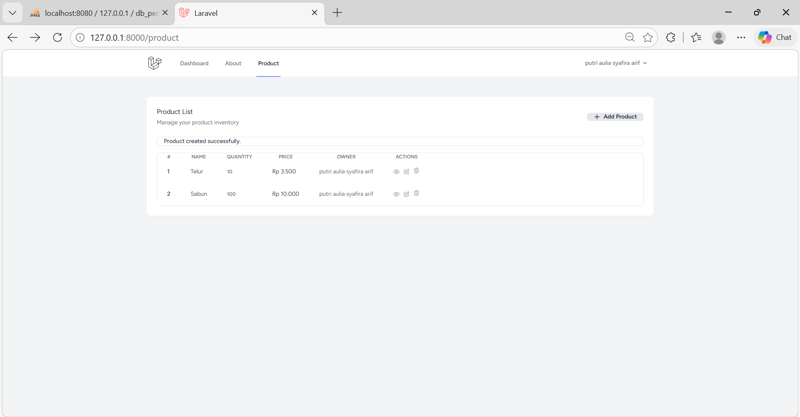 | 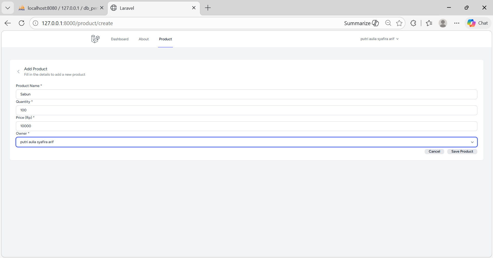 | 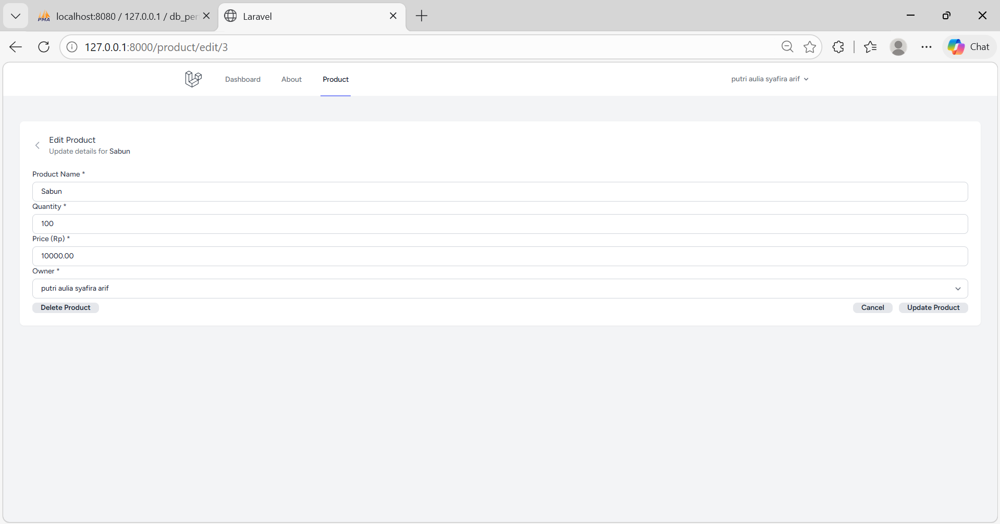 | 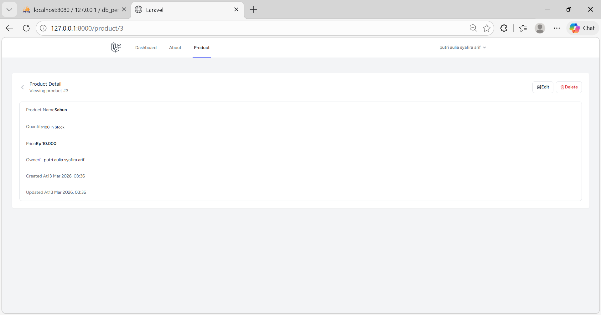 |   